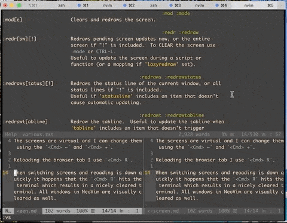

Part of my current workflow for web development is writing code in NeoVim in an iTerm2 Terminal on one screen and checking results in the browser on another screen.
The screens are virtual and can be changed using  +  and  + .
I reload a browser tab using  + .

When switching screens and reloading is down quickly it happens that the  +  hits the terminal which results in a nicely cleared terminal.
All windows in NeoVim are cleared as well. This is especially annoying when I have multiple windows.

A time-saving command is `:mod`, which redraws all vim windows. Even faster is the shortcut is  + .

The following animation shows the command in action.

See `:help mod` for further documentation.

